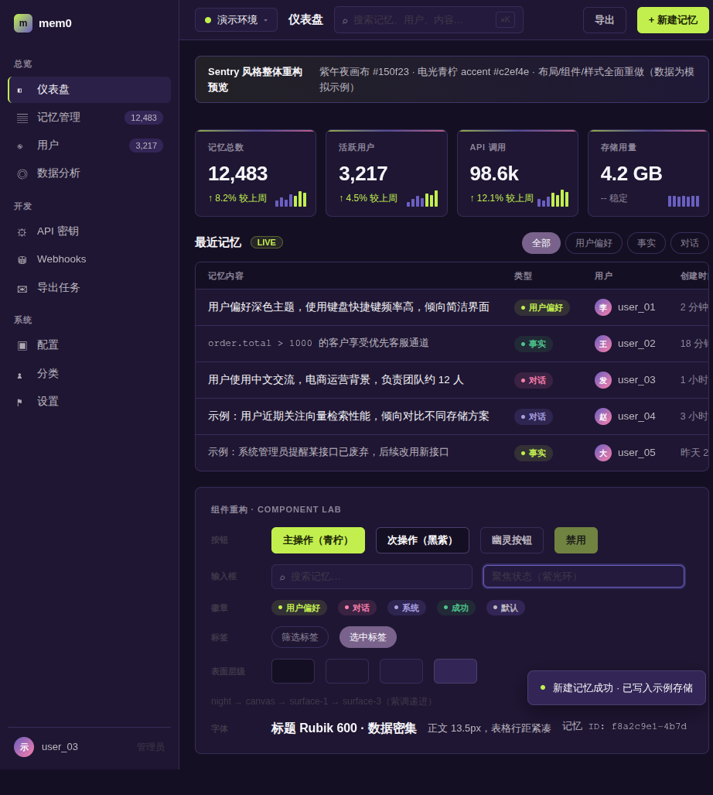

# mem0_falkordb —— 图增强记忆层

> 基于 [mem0ai/mem0](https://github.com/mem0ai/mem0) 的增强版 Fork，聚焦**生产可用**：恢复图数据库支持、补齐记忆衰减/清理/反馈闭环/可观测性等自部署场景必需能力。

---

## 目录

- [项目定位](#项目定位)
- [核心能力全景](#核心能力全景)
- [架构](#架构)
- [快速开始](#快速开始)
- [配置](#配置)
- [功能详解](#功能详解)
- [运维](#运维)
- [环境要求](#环境要求)
- [许可证](#许可证)

---

## 项目定位

mem0 是一个为 AI Agent 提供持久记忆的开源库（存/搜/删 + LLM 事实提取）。本 Fork 在 mem0 全部能力的基础上，做了三类增强：

| 类别 | 内容 |
|------|------|
| **图存储恢复** | 完整恢复 `graphs/` 模块，内置 FalkorDB 图数据库后端（真 Cypher 图，可遍历可查询） |
| **生产级能力** | 记忆衰减、过期清理、语义去重、矛盾检测、时间推理、深度路由、rerank、中文全链路 |
| **可观测与进化** | 搜索质量观测、记忆热度体系、反馈闭环、进化循环、统计面板、召回漏斗 trace |

---

## 核心能力全景

### 图存储与检索

| 能力 | 说明 |
|------|------|
| FalkorDB 图后端 | 内置集成，配置即用；实体节点 + 关系边 + 引用计数 + 每用户独立图 |
| 图记忆时效 | 冲突消解改为**失效保留**（`invalidated_at` 标记），检索默认只出有效事实，同事实重现自动复活，误判可恢复 |
| 搜索增强 | 向量 + BM25 + 图关系合并，full 深度返回图召回片段 |
| 三级深度路由 | minimal（跳过检索）/ standard（向量+BM25）/ full（含图+rerank），自动识别废话降本 40-60% |

### 记忆质量

| 能力 | 开关 | 说明 |
|------|------|------|
| 记忆衰减 | `MEM0_ENABLE_DECAY=true` | 指数衰减 + Lane 分轨（importance=5 永不衰减 / slow / normal / fast 三速） |
| 语义去重 | cron 每日 | 三层判定（向量粗筛 → 字符相似 → LLM 二元确认），合并近重复记忆，不压缩内容 |
| 矛盾检测 | `MEM0_ENABLE_CONTRADICTION=true` | 写入时实时判定，自动清理冲突旧记忆 |
| 时间推理 | 默认开启 | 每条记忆自动标注 PAST/PRESENT/FUTURE/TIMELESS，可过滤 |
| 记忆热度 | 默认开启 | access_count / last_access 随搜索更新，热度参与排序（权重可配） |
| 显式反馈闭环 | 默认开启 | useful/useless/correction 三档反馈直接调整记忆热度分，可审计可逆 |

### 可观测与进化

| 能力 | 说明 |
|------|------|
| 搜索质量观测 | 每次搜索落日志：查询词/召回数/平均分/耗时/是否零命中 |
| 进化循环 | cron 每日：高频记忆自动提权 + 零命中统计 + 长期未召回清单 |
| Analytics 面板 | Dashboard 五个真实数据面板（中文）：搜索质量/反馈闭环/热度健康/操作概览/召回漏斗 |
| RECALL 召回漏斗 | 搜索链路五阶段（候选池→阈值→衰减→图→rerank→最终）命中数与耗时可视化 |
| 清理/保留决策 | 面板上直接对未召回记忆点「清理」或「保留」，不用看文档 |

### 部署与兼容

| 能力 | 说明 |
|------|------|
| 配置文件驱动 | `MEM0_CONFIG_PATH` 指向 config.json，纯配置部署，无需调 API |
| 自动管理员 | 容器启动自动创建 `admin@mem0.dev` + 随机密码，日志可见 |
| 49 个环境变量 | 连接池/超时/批量/并发/衰减/清理/反馈/深度路由全覆盖 |
| 中文全链路 | 记忆提取/图实体/图关系/BM25 分词全汉化 |
| Embedder 兼容 | VoyageAI base64 自动适配；pgvector 维度自动检测 |
| Reranker | SiliconFlow 原生支持 + 分数阈值过滤 |
| Docker 就绪 | 预装依赖，`docker compose up -d` 开箱即用 |

---

## 架构

```
┌─────────────────────────────────────────────────┐
│                  AI Agent                        │
│         add() / search() / delete()              │
└────────────────────┬────────────────────────────┘
                     │
┌────────────────────▼────────────────────────────┐
│              Mem0 SDK + graphs 模块              │
│  ┌──────────┐  ┌───────────┐  ┌──────────────┐  │
│  │ 向量存储  │  │ 实体存储   │  │ 图存储       │  │
│  │ (pgvector│  │           │  │ (FalkorDB)   │  │
│  └──────────┘  └───────────┘  └──────┬───────┘  │
│                                      │           │
│  ┌─────────── 可观测/进化层 ─────────┐           │
│  │ evolve_queries / evolve_salience │           │
│  │ evolve_feedback / trace 五阶段    │           │
│  └───────────────────────────────────┘          │
└─────────────────────────────────────────────────┘
                     │
┌────────────────────▼────────────────────────────┐
│  存储层                                         │
│  · PostgreSQL (pgvector) — 向量 + 元数据 + 观测表 │
│  · FalkorDB — 每用户独立图（mem0_{user_id}）    │
└─────────────────────────────────────────────────┘
```

---

## 快速开始

### Server 部署（推荐，自带 Dashboard）

```bash
git clone https://github.com/dlhermes/mem0_falkordb.git
cd mem0_falkordb/server
```

**第一步：创建配置文件**（模型配置）

```bash
cp config.json.example config.json
# 编辑 config.json，填入真实 API key
```

配置文件结构：

```json
{
  "llm":         { "provider": "openai", "config": { "model": "...", "api_key": "sk-...", "openai_base_url": "" } },
  "embedder":    { "provider": "openai", "config": { "model": "...", "api_key": "sk-...", "openai_base_url": "" } },
  "reranker":    { "provider": "siliconflow", "config": { "model": "BAAI/bge-reranker-v2-m3", "api_key": "sk-..." } },
  "graph_store": { "provider": "falkordb", "config": { "host": "falkordb", "port": 6379, "database": "mem0" } }
}
```

> ⚠️ LLM 配置的字段名是 `openai_base_url`，不是 `api_base`，填错会导致容器启动崩溃。
>
> ⚠️ **必须配置 `vector_store`（pgvector）**，否则 mem0 默认用内存向量库，容器重启后记忆全部丢失。

**第二步：创建环境变量**（基础设施配置）

```bash
cp .env.example .env
# 最少设置 POSTGRES_PASSWORD 和 JWT_SECRET
```

```bash
POSTGRES_PASSWORD=改一个强密码
JWT_SECRET=随机字符串至少32位
DASHBOARD_URL=http://你的服务器IP:3002
API_EXTERNAL_URL=http://你的服务器IP:8888
MEM0_CONFIG_PATH=/app/config.json
```

> `DASHBOARD_URL` 必须用 `http://`，用 `https://` 会导致 Dashboard Cookie 被浏览器拒绝。

**第三步：启动**

```bash
docker compose up -d
```

**第四步：登录 Dashboard**

浏览器访问 `http://你的服务器IP:3002`。管理员账号自动创建，凭据在日志中：

```bash
docker compose logs mem0 | grep -E "(admin|密码)"
```

登录后默认进入**仪表盘**（记忆/实体/请求统计总览）；顶栏搜索框可全局检索记忆，侧边栏进入各管理页面。

### 仅使用 Python SDK

```bash
git clone https://github.com/dlhermes/mem0_falkordb.git
cd mem0_falkordb
pip install build
python3 -m build --wheel
pip install dist/mem0_graph-*.whl
pip install falkordb
docker run -d --rm -p 6379:6379 falkordb/falkordb
```

```python
from mem0 import Memory

config = {
    "graph_store": {
        "provider": "falkordb",
        "config": {"host": "localhost", "port": 6379, "database": "mem0"},
    },
    "vector_store": {
        "provider": "pgvector",
        "config": {"host": "localhost", "port": 5432, "user": "postgres", "password": "...", "dbname": "mem0"},
    },
    "llm": {"provider": "openai", "config": {"model": "gpt-4o-mini"}},
    "embedder": {"provider": "openai", "config": {"model": "text-embedding-3-small"}},
}

m = Memory.from_config(config)
m.add("我喜欢披萨", user_id="alice")
results = m.search("alice 喜欢什么？", user_id="alice")
```

---

## 配置

### config.json（模型与图存储）

| 块 | 说明 |
|----|------|
| `llm` | 事实提取大模型（OpenAI 兼容任意服务） |
| `embedder` | 向量模型（OpenAI / VoyageAI / 本地 bge 等） |
| `reranker` | 可选，配置后搜索自动重排序 |
| `graph_store` | `provider: "falkordb"`，见 [docs/falkordb-integration.md](docs/falkordb-integration.md) |

**推理模型适配**：若 LLM 把回复放在 `reasoning_content` 而 `content` 为空（典型：自部署 Qwen3.5 / DeepSeek-R1），记忆提取会全部为空（日志 `results=0`）。在 `llm.config` 加：

```json
"reasoning_effort": "none"
```

### .env（基础设施）

| 变量 | 默认 | 说明 |
|------|------|------|
| `POSTGRES_PASSWORD` | — | 必填 |
| `JWT_SECRET` | — | 必填，≥32 位 |
| `DASHBOARD_URL` | http://localhost:3002 | 必须 http |
| `API_EXTERNAL_URL` | http://localhost:8888 | 对外 API 地址 |
| `MEM0_CONFIG_PATH` | /app/config.json | 配置文件路径 |

### 常用功能开关

```bash
MEM0_ENABLE_DECAY=true              # 记忆衰减（默认关）
MEM0_DECAY_HALF_LIFE_DAYS=30        # 衰减半衰期（天）
MEM0_ENABLE_CONTRADICTION=true      # 矛盾检测（默认关）
MEM0_SEARCH_DEPTH_AUTO=true         # 深度路由自动判定
MEM0_SEARCH_DEPTH_DEFAULT=full      # 默认深度（full = 含图+rerank）
MEM0_EVOLVE_RANK_WEIGHT=0.2         # 热度排序加成权重（0 = 不生效）
MEM0_RERANK_SCORE_THRESHOLD=0.4     # rerank 后保留最低分
MEM0_RERANK_QUERY_MAX_CHARS=4000    # rerank query 截断
MEM0_RERANK_DOCS_MAX_CHARS=6000     # rerank 候选文档分批阈值
```

完整变量清单见 [server/README.md](server/README.md) 性能调优节。

---

## 功能详解

### 图存储（FalkorDB）

- 图存储接口层完整恢复，FalkorDB 直接编译进 `GraphStoreFactory`，配置即用，无需补丁
- 每用户独立图（`mem0_{user_id}`），实体节点 + 关系边 + 引用计数
- 中文关系名（`部署于`、`偏好`）经 backtick 转义直接写入，无需英文映射
- 详见 → **[docs/falkordb-integration.md](docs/falkordb-integration.md)**

### 图记忆时效（Temporal Validity）

冲突消解从「物理删除」改为「失效保留」：

- 旧关系不再删除，写入 `invalidated_at` 标记失效
- 检索默认只返回有效事实（`invalidated_at IS NULL`）
- 同事实再次出现自动复活（重置失效标记）
- 存量关系无标记视为有效，向后兼容；零额外 LLM 调用

**价值**：LLM 误判冲突只是「误失效」——可追溯、可恢复，而非永久丢失。

### 记忆衰减

```
score' = score × 0.5 ** (age_days / (half_life × lane_multiplier))
```

| 档位 | 半衰期 | 触发 |
|------|--------|------|
| 永不衰减 | ∞ | LLM 判 importance=5 |
| 慢衰减 | ~100 天 | lane=slow / 关键词含「踩坑/报错/步骤/流程/配置」 |
| 正常衰减 | ~30 天 | 兜底 |
| 快衰减 | ~20 天 | lane=fast / 关键词含「开心/心情/今天/临时」 |

### 搜索深度路由

| 深度 | 链路 | 降本 |
|------|------|------|
| `minimal` | 跳过全部检索（命中废话白名单） | 100% |
| `standard` | embedding + BM25（跳过图 + rerank） | ~70% |
| `full` | embedding + BM25 + 图 + rerank（默认） | 0% |

深度自动判定在 `Memory.search()` 入口执行；词表存 SQLite `search_keywords` 表（路径 `/app/history/history.db`），增删词即生效，无需重启。每次搜索实际走的深度记录在 `evolve_queries.depth`，可在 Analytics「召回漏斗」观测。

### 记忆热度体系

- 每条记忆随搜索更新 `access_count` / `last_access_at`
- 热度分参与排序：`最终分 = 向量分 × decay × (1 + 权重 × heat_effective)`
  - `heat_effective = min(access_count/100, 1) + (salience_score − 1)`
  - 权重由 `MEM0_EVOLVE_RANK_WEIGHT` 控制，默认 0 时不改变现有排序
- 时间衰减管「时间」，热度管「使用频率」，互不叠加

### 显式反馈闭环

对话层捕获用户纠正信号（或人工在接口/面板标记），通过 `POST /evolve/feedback` 调整记忆热度分：

| 反馈 | 热度变化 |
|------|---------|
| useful（有用） | +0.1 |
| useless（无用） | −0.15 |
| correction（内容错误） | −0.05 |

只改热度分、不改记忆内容；每条反馈落审计表（evolve_feedback / evolve_salience_adjustments），可追溯、误报可逆。

### 进化循环（cron 每日 06:00）

- **高频提权**：access_count ≥ 5 的记忆自动加分（`+min(0.05, (acc−4)×0.01)`，上限 1.5），当日幂等
- **零命中统计**：24h 内零命中查询聚合清单
- **未召回清单**：14 天未被召回的观察清单（只提示不自动降权，由人决策）

### 管理后台（Dashboard）

随 Server 自带 Web 管理后台（`http://<host>:3002`，登录后默认进入仪表盘）。界面为 **Sentry 风格**（紫午夜画布 + 电光青柠 accent，深色/浅色双主题，可在设置中切换），全中文界面。

| 页面 | 能力 |
|------|------|
| 仪表盘（默认首页） | 记忆/实体/请求统计卡 + 成功率/平均延迟 + 最近请求与记忆 |
| 全局搜索 | 顶栏搜索框即时检索全部记忆（SQL 层，不受条数限制），回车直达记忆页搜索结果 |
| 记忆 | 列表/详情/历史演化查看、按用户/类型/时间筛选、单选与批量删除、语义结果页 |
| 请求 | API 请求日志：方法/状态段/时间筛选、统计卡、详情抽屉 |
| 实体 | 实体统计卡（用户/代理/运行分布）、类型筛选、详情抽屉 |
| 分析 | 五个中文数据面板（搜索质量/反馈闭环/热度健康/操作概览/召回漏斗） |
| API 密钥 | 创建/吊销/列表管理 |
| 配置 | LLM / 嵌入 / 重排序 / 图数据存储独立配置（provider、model、API Key、Base URL）+ 检索参数（深度检索、车道、重排阈值）+ 提取指令编辑，**保存即热生效** |
| 设置 | 深色/浅色主题切换、修改密码、实例信息（当前模型与存储后端）、**深度路由词汇管理**（minimal/standard/full 三级词汇增删，命中即路由，无需重启） |

界面预览（演示数据）：



### Analytics 面板（Dashboard）

五个中文数据面板：

| 面板 | 内容 |
|------|------|
| 搜索质量 | 查询量/零命中率/平均分/延迟（7/30 天）+ 每日趋势 + 零命中 Top 查询 |
| 反馈闭环 | useful/useless/correction 分布 + 被纠正最多记忆 |
| 热度健康 | 热度分布 + 高频记忆 + 未召回清单（可点「清理/保留」决策）+ 提权记录 |
| 操作概览 | 请求量/延迟/成功率 |
| 召回漏斗 | 搜索五阶段命中数与耗时（RECALL trace） |

### RECALL 召回漏斗

搜索链路每个阶段采集命中数与耗时：候选池 → 阈值过滤 → 时间衰减 → 图召回 → 重排序 → 最终。用于定位「搜不到」的病灶（哪一阶段丢的）与性能瓶颈（哪一阶段慢）。

### 语义去重（cron 每日 05:00）

三层判定合并近重复记忆：

1. 向量粗筛：cosine 相似度 > 阈值（无 LLM）
2. 字符 Jaccard 预筛：明显不同措辞直接跳过（无 LLM）
3. LLM 二元判定：剩余候选对「同事实？YES/NO」

只合并近重复、不压缩内容，安全性优先。

### 矛盾检测

开启后 LLM 在每次写入时自动对比新消息与已有记忆，发现矛盾自动清理旧记忆，写入即检测。

### 时间推理

每条记忆自动标注 `temporal`（PAST/PRESENT/FUTURE/TIMELESS），搜索可用 `filters: {"temporal": "FUTURE"}` 过滤；零额外 LLM 调用。

---

## 运维

### cron 任务（Hermes cronjob 调度）

| 任务 | 时间 | 内容 |
|------|------|------|
| mem0-prune-request-logs | 每日 03:00 | API 请求日志清理 |
| mem0-prune-refresh-tokens | 03:30 | 刷新令牌清理 |
| mem0-prune-history-db | 03:45 | history.db 清理 + VACUUM |
| mem0-prune-expired-memories | 04:00 | 过期记忆 + FalkorDB 孤立节点清理 |
| mem0-dedup-memories | 05:00 | 语义去重 |
| mem0-evolve-cycle | 06:00 | 进化循环（高频提权/零命中/未召回清单） |

所有脚本支持 dry-run 环境变量（`PRUNE_DRY_RUN=true` / `CONSOLIDATION_DRY_RUN=true` / `EVOLVE_DRY_RUN=true`），watchdog 模式：无动作静默，有动作才输出。

### 常用管理命令

```bash
docker compose logs mem0            # 查看日志
docker compose restart mem0         # 重启（config.json 变更生效）
docker compose up -d --force-recreate mem0   # 重建（.env 变更需重建）
```

**重置管理员密码**：容器内执行 `python3 scripts/reset_admin_password.py`。

---

## 环境要求

- Python 3.10-3.12
- Docker（FalkorDB + PostgreSQL）
- FalkorDB ≥ 1.6.0
- PostgreSQL（pgvector/pgvector:pg17 镜像，已预装向量扩展）

---

## 许可证

Apache 2.0 —— 与上游 [mem0ai/mem0](https://github.com/mem0ai/mem0) 一致。
